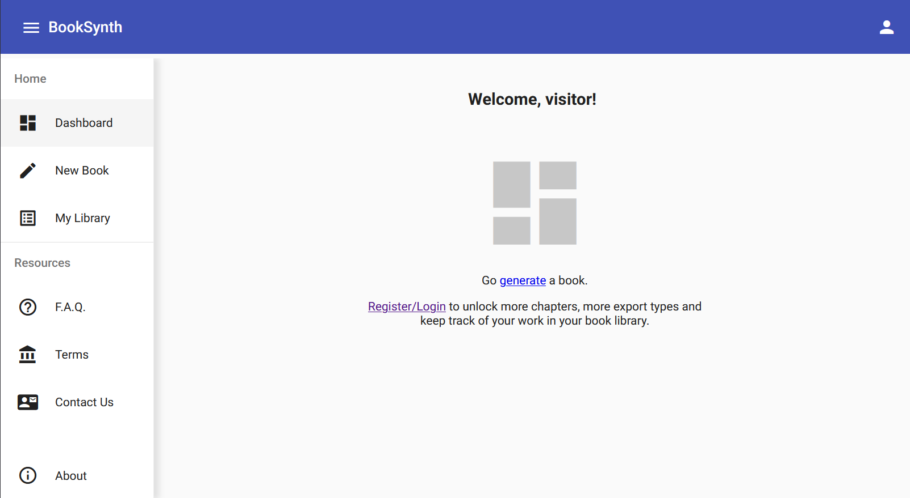
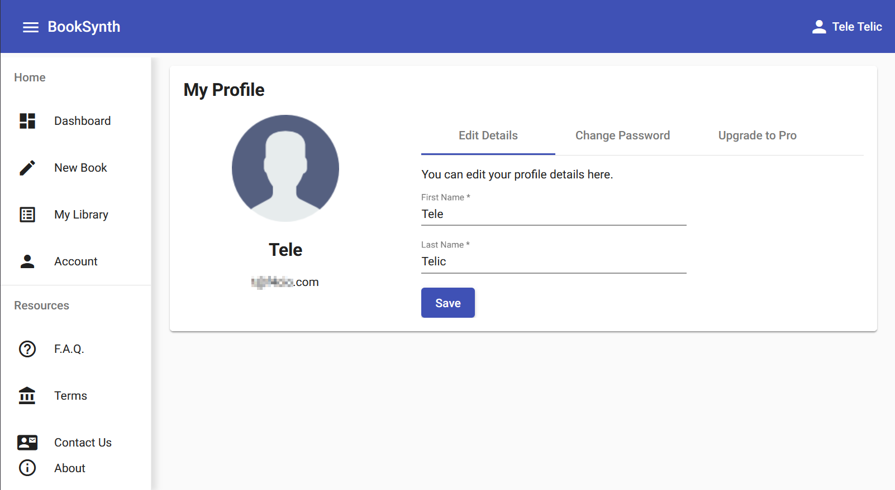
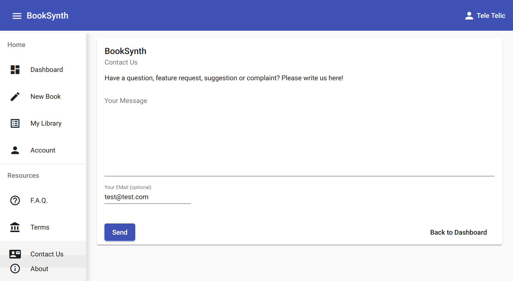
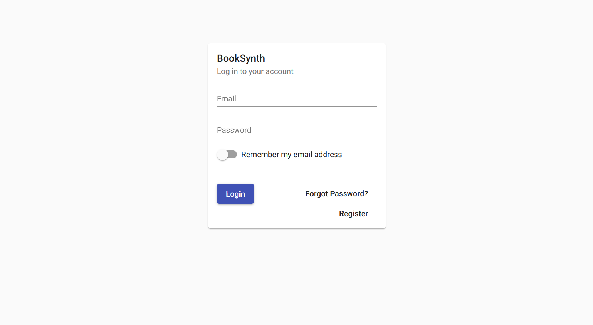
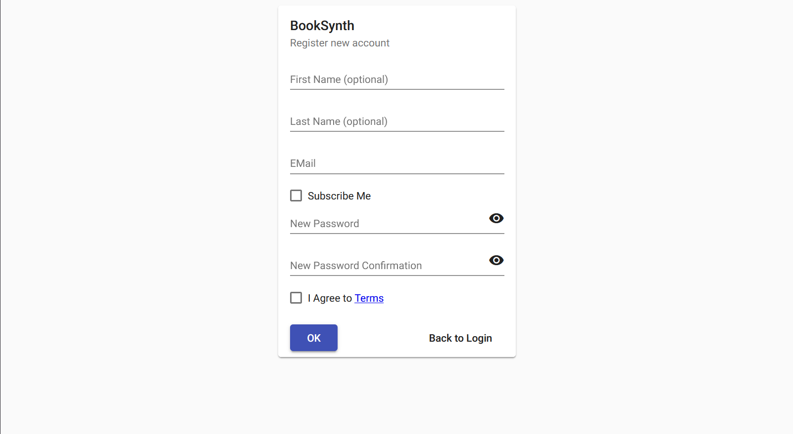
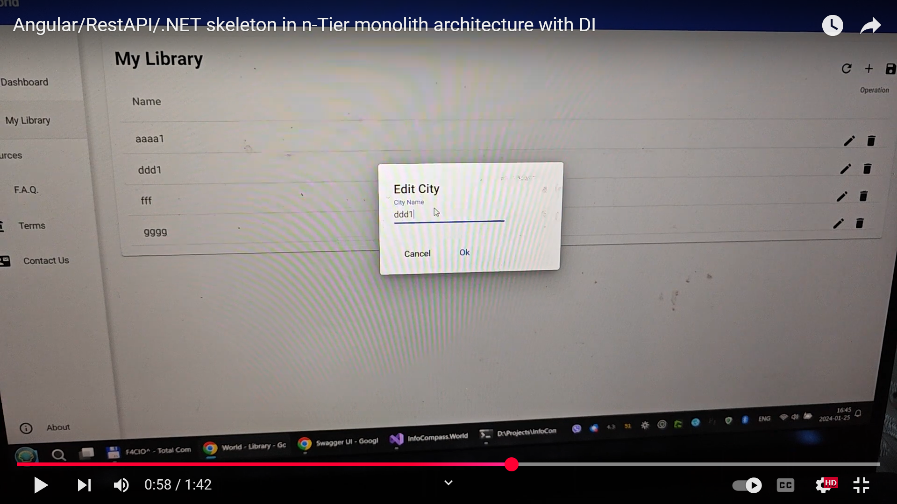

full live production site built on this architecture skeleton is here: https://www.booksynth.com
video of this architecture skeleton here (stripped down live site): https://www.youtube.com/watch?v=02A93I1ZDks

as usual before first build/run you must restore node modules by positioning command prompt into ...\InfoCompass.World.AngularUI folder and running commands: 
"npm install" and "ng serve"

for user management screens to work (register/login/reset password) you must configure your smtp server in  ...\InfoCompass.World.BusinessLogic\Data\Settings.json

